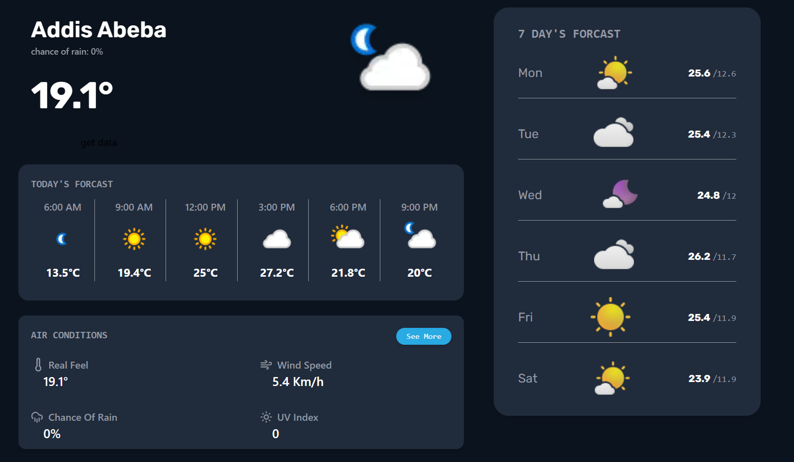
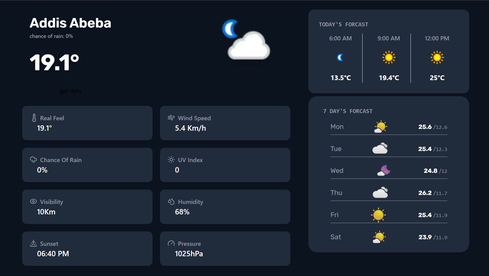

# Weather App

A modern, responsive weather application built with React that provides real-time weather information and forecasts.

## Prerequisites

- Node.js (v14 or higher)
- npm (v6 or higher)
- A Weather API key (We use WeatherAPI.com)

## Installation

1. Clone the repository:
```bash
git clone <your-repo-url>
cd weather-App
```

2. Install all required dependencies:
```bash
npm install react react-dom
npm install react-router-dom
npm install axios
npm install moment
npm install lucide-react
npm install tailwindcss postcss autoprefixer
npm install @vitejs/plugin-react
npm install vite
```

Or simply run:
```bash
npm install
```

3. Create a `.env` file in the root directory and add your Weather API key:
```env
VITE_WEATHER_API_KEY=your_api_key_here
```

4. Initialize Tailwind CSS:
```bash
npx tailwindcss init -p
```

## API Setup

### Tomorrow.io API
1. Sign up for a free API key at [Tomorrow.io](https://www.tomorrow.io/)
2. Create a `.env` file in the root directory and add your Tomorrow.io API key:
```env
VITE_TOMORROW_API_KEY=your_tomorrow_io_api_key_here
```

3. The free tier includes:
   - 1000 calls per day
   - Real-time weather
   - 5-day forecasts
   - Weather alerts
   - Air quality data

### BigDataCloud API (for Reverse Geocoding)
1. Sign up for a free API key at [BigDataCloud](https://www.bigdatacloud.com/)
2. Add your BigDataCloud API key to the `.env` file:
```env
VITE_BIGDATACLOUD_API_KEY=your_bigdatacloud_api_key_here
```

3. The free tier includes:
   - 10,000 requests per month
   - Reverse geocoding
   - Location data

### Complete .env File Example
```env
VITE_TOMORROW_API_KEY=your_tomorrow_io_api_key_here
VITE_BIGDATACLOUD_API_KEY=your_bigdatacloud_api_key_here
```

Note: Make sure to replace `your_tomorrow_io_api_key_here` and `your_bigdatacloud_api_key_here` with your actual API keys. Never commit your `.env` file to version control.

## Project Structure

## Features

### Current Weather Display
- Real-time temperature display
- Location-based weather information
- Weather condition icons
- Chance of rain indicator

### Today's Forecast
- Hourly weather predictions
- Temperature variations
- Weather condition icons for each time slot
- Clean, grid-based layout

### Air Conditions
- Real feel temperature
- Wind speed measurements
- Chance of rain percentage
- UV index
- Visibility metrics
- Humidity levels
- Sunset time
- Atmospheric pressure

### 7-Day Forecast
- Extended weather predictions
- Daily temperature ranges
- Weather condition indicators
- Clean, organized layout

## Features in Detail

### Weather Information Display
- Current temperature in Celsius
- Location name
- Weather condition with appropriate icons
- Real-time updates

### Air Conditions Panel
- Expandable section with detailed weather metrics
- Clean grid layout for easy reading
- Modern iconography using Lucide React
- Interactive "See More" functionality

### Forecast Sections
- Today's hourly forecast
- 7-day extended forecast
- Temperature ranges
- Weather condition indicators
- Time-based predictions

## UI/UX Highlights

- **Modern Design**: Clean, minimalist interface
- **Responsive Layout**: Adapts to all screen sizes
- **Intuitive Navigation**: Easy-to-use interface
- **Visual Hierarchy**: Clear information organization
- **Consistent Styling**: Uniform design language throughout

## Future Enhancements

- [ ] Add temperature unit toggle (Celsius/Fahrenheit)
- [ ] Implement location search
- [ ] Add weather alerts
- [ ] Include weather maps
- [ ] Add weather history
## Screenshots 




## Contributing

Feel free to submit issues and enhancement requests!

## License

This project is licensed under the ISC License.
